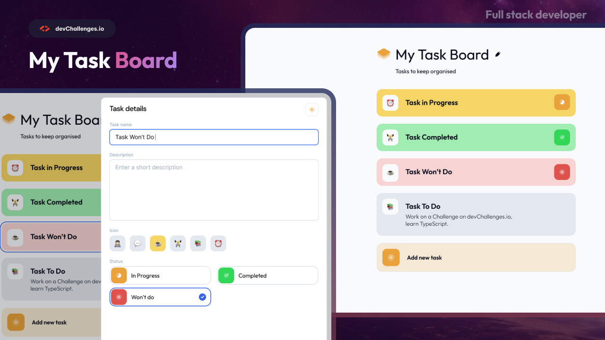

# My Task Board

## Welcome! 👋

Welcome to this responsive web coding challenge.

## The challenge

Your task is to create a web page that closely resembles the provided design.

You can use any tools or resources you like to complete this challenge. Each challenge is designed to practice different skills, so be sure to check the challenge description for more information.

## Where to find everything

Your goal is to build the project using the provided design. You can find the designs in the challenge editor once you start the challenge or in the `/design` folder. Please note that the `/design` folder may not include all the designs you need, so be sure to check the editor for more details.

The designs are in JPG format, so you'll need to use your best judgment for styles such as `font-size`, `padding`, and `margin`.

All the required assets can be found in the `/resources` folder. You may need to optimize the assets as necessary.

## Steps to Complete the Challenge on devChallenges.io

- [ ] Create a Git Repository for this challenge
- [ ] Initialize the project as a Git repository.
- [ ] Download the starter/resources.
- [ ] Review the design and analyze the different versions for desktop, tablet, and mobile.
- [ ] Plan your approach to the project by identifying reusable CSS classes and structuring your HTML content.
- [ ] Define the base styles for your project, including font-family, font-size, and other general content styles.
- [ ] Begin adding styles from the top of the page and work your way down, ensuring that each section is visually appealing and matches the provided design.
- [ ] Optimize and resize the required assets from the `/images` folder as necessary.
- [ ] Test your project's responsiveness by previewing it on different devices and screen sizes.
- [ ] Once you are satisfied with your implementation, deploy your project to a hosting platform if possible otherwise be prepared to demo it during your interview.
- [ ] Replace the default `README.md` file with a custom one that explains your project and reflects on your learning experience. You can use the provided `README-template.md` as a starting point.
- [ ] Make sure to commit frequently.

Good luck and enjoy building your project! 🚀
